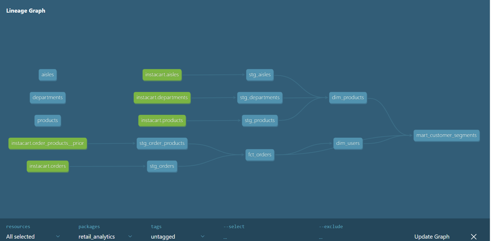

# Retail Analytics — dbt + DuckDB

## Overview
An end-to-end analytics engineering project built on the
[Instacart Market Basket dataset](https://www.kaggle.com/datasets/yasserh/instacart-online-grocery-basket-analysis-dataset),
demonstrating modern data stack patterns including staged transformation
layers, dimensional modeling, and data quality testing using dbt Core and DuckDB.

## Tech Stack
- **dbt Core 1.11** — transformation and modeling layer
- **DuckDB 1.10** — local analytical warehouse
- **Python 3.13** — bulk data loading utilities
- **Dataset** — Instacart Market Basket (32M+ order line items)

## Project Structure

```
models/
├── staging/        # One model per source table. Light cleaning only —
│                   # type casting, column renaming, dropping unused fields.
│                   # All staging models materialize as views.
└── marts/          # Dimensional models and fact tables built on top of
                    # the staging layer. Materialize as tables.
```

### Lineage Graph


## Data Model

### Source Tables

| Table | Grain | Description |
|---|---|---|
| `orders` | One row per order | Order timing attributes — day of week, hour of day, days since prior order |
| `products` | One row per product | Product name with aisle and department foreign keys |
| `aisles` | One row per aisle | Aisle ID and name |
| `departments` | One row per department | Department ID and name |
| `order_products__prior` | One row per product per order | Cart addition sequence and reorder flag |

### Staging Models

| Model | Source | Key Transformations |
|---|---|---|
| `stg_orders` | `orders` | Drop `eval_set`, clean column selection |
| `stg_products` | `products` | `TRIM()` on product name |
| `stg_aisles` | `aisles` | Rename `aisle` → `aisle_name` |
| `stg_departments` | `departments` | Rename `department` → `department_name` |
| `stg_order_products` | `order_products__prior` | Cast `BIGINT` → `INTEGER` on keys, `reordered` → `BOOLEAN` |

### Mart Models

| Model | Grain | Description |
|---|---|---|
| `dim_products` | One row per product | Denormalized product dimension with aisle and department attributes |
| `dim_users` | One row per user | User-level behavioral metrics — order frequency, reorder rate, basket size |
| `fct_orders` | One row per order line | 32M row fact table joining order lines to order header attributes |
| `mart_customer_segments` | One row per user | Percentile-based customer segmentation with department affinity |

## Testing

37 data quality tests across all models including:

- **Primary key** — unique and not null on all dimension and fact tables
- **Referential integrity** — every `product_id` in order lines exists in products, every `user_id` in `dim_users` exists in `fct_orders`
- **Accepted values** — segment labels and boolean flags validated against known value sets
- **Not null** — all critical foreign keys and metric columns asserted non-null

Run all tests with:

```bash
dbt test
```

## How to Run

### Prerequisites
- Python 3.8+
- dbt-core and dbt-duckdb installed
- Instacart dataset downloaded from [Kaggle](https://www.kaggle.com/datasets/yasserh/instacart-online-grocery-basket-analysis-dataset)

### Setup

**1. Clone the repo**

```bash
git clone https://github.com/mapdx/retail_analytics.git
cd retail_analytics
```

**2. Install dependencies**

```bash
pip install dbt-core dbt-duckdb
```

**3. Configure your dbt profile**

Create `~/.dbt/profiles.yml` with the following:

```yaml
retail_analytics:
  target: dev
  outputs:
    dev:
      type: duckdb
      path: dev.duckdb
```

**4. Load source data**

Place the Instacart CSVs in the `seeds/` folder, then run:

```bash
dbt seed
```

For `order_products__prior.csv` (577MB), use the bulk loader script:

```bash
python scripts/load_order_products.py
```

> Update `csv_path` in the script to point to your local copy of `order_products__prior.csv`

**5. Run the project**

```bash
dbt run
```

## Key Concepts Demonstrated
- **Staged transformation layer** — one staging model per source table with
  clearly defined cleaning responsibilities
- **Type consistency** — explicit casting of join keys and semantic types
  (e.g. reorder flag cast from BIGINT to BOOLEAN) at the staging layer
- **Hybrid data loading** — dbt seeds for small reference tables,
  DuckDB native CSV reader for large transactional data
- **Dimensional modeling** — fact and dimension tables built on a clean staging foundation
- **dbt testing** — schema-level data quality tests on primary keys and
  referential integrity (e.g. every `product_id` in `stg_order_products`
  must exist in `stg_products`)
- **Customer segmentation** — percentile-based behavioral segmentation using
  `PERCENTILE_CONT` for dynamic p33/p66 thresholds across order frequency
  and reorder rate dimensions